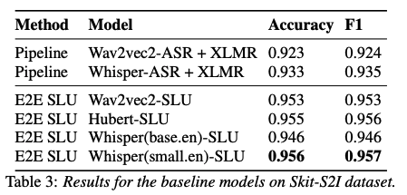

# Skit-S2I baselines
This directory contains the code for the baselines in the paper [Skit-S2I: An Indian Accented Speech to Intent dataset](https://arxiv.org/abs/2212.13015). 

## Installation
Download the dataset
```
wget https://speech-to-intent-dataset.s3.ap-south-1.amazonaws.com/speech-to-intent.zip
unzip speech-to-intent.zip
```
<br>

Install the necessary packages
```
conda env create -f environment.yml
```

## Training the baseline
```
python trainer_whisper.py
```

## Testing the baseline
```
python test.py
```

## Results
Baseline results for end-to-end intent classification from speech using Skit-S2I dataset, the benchmark is tracked [here](https://paperswithcode.com/sota/speech-intent-classification-on-skit-s2i).



## Citation
```
@article{rajaa2022skit,
  title={Skit-S2I: An Indian Accented Speech to Intent dataset},
  author={Rajaa, Shangeth and Dalmia, Swaraj and Nethil, Kumarmanas},
  journal={arXiv preprint arXiv:2212.13015},
  year={2022}
}
```